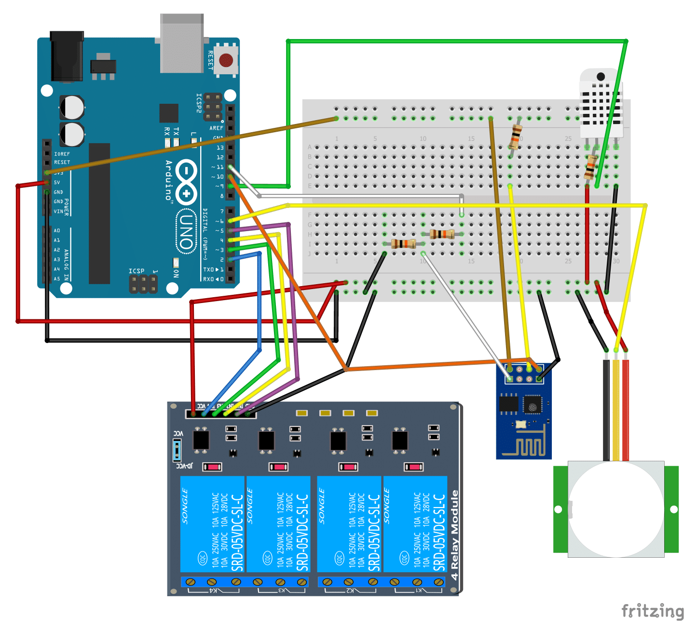
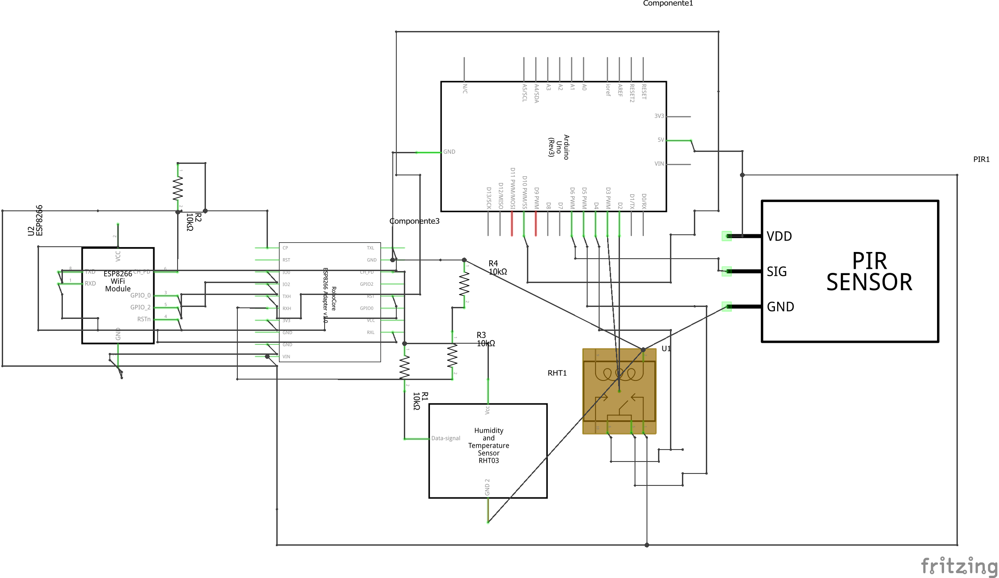

# Descriçao do Hardware

1) Lista de Peças

* 1 Protoboard de 400 pontos ou maior
* 1 Arduino UNO R3
* 1 Módulo Relé de 4 vias
* 1 Senor de Presença PIR - HC-SR501
* 1 Módulo WiFi - ESP8266
* 1 Adaptador para ESP8266 da RoboCore (não necessário mas altamente recomendado)
* 1 Sensor de Temperatura DHT22
* 4 resistores de 10k ohms
* Jumpers

2) Desenho do Circuito

3) Esquema eletrônico

4) Materiais para confecção de caixas

* 4 Placas de Madeira MDF 30cm x 30cm
* 1 Pacote de pregos 1.6mm
* 1 Fita Dupla Face
* 1 Martelo
